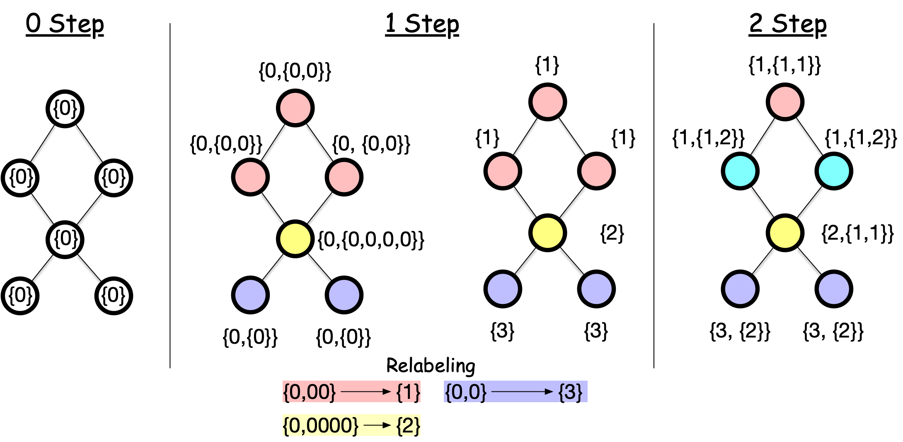

---
jupytext:
  formats: md:myst
  text_representation:
    extension: .md
    format_name: myst
kernelspec:
  display_name: Python 3
  language: python
  name: python3
---

# Popular Graph Neural Networks

In this note, we will introduce three popular GNNs: GraphSAGE, Graph Attention Networks (GAT), and Graph Isomorphism Network (GIN).

## GraphSAGE: Sample and Aggregate

GraphSAGE {footcite}`hamilton2017graphsage` introduced a different GCN that can be ***generalized to unseen nodes*** (they called it "inductive"). While previous approaches like ChebNet and GCN operate on the entire graph, GraphSAGE proposes an inductive framework that generates embeddings by sampling and aggregating features from a node's neighborhood.


### Key Ideas

GraphSAGE involves two key ideas: (1) sampling and (2) aggregation.

#### Neighborhood Sampling

The key idea is the *neighborhood sampling*. Instead of using all neighbors, GraphSAGE samples a fixed-size set of neighbors for each node. This controls memory complexity, a key limitation of the previous GNNs.

Another key advantage of neighborhood sampling is that it enables GraphSAGE to handle dynamic, growing networks. Consider a citation network where new papers (nodes) are continuously added. Traditional GCNs would need to recompute filters for the entire network with each new addition. In contrast, GraphSAGE can immediately generate embeddings for new nodes by simply sampling their neighbors, without any retraining or recomputation.

#### Aggregation

Another key idea is the *aggregation*. GraphSAGE makes a distinction between self-information and neighborhood information. While previous GNNs treat them equally and aggregate them, GraphSAGE treats them differently. Specifically, GraphSAGE introduces an additional step: it concatenates the self-information and the neighborhood information as the input of the convolution.

$$
Z_v = \text{CONCAT}(X_v, X_{\mathcal{N}(v)})
$$

where $X_v$ is the feature of the node itself and $X_{\mathcal{N}(v)}$ is the aggregation of the features of its neighbors. GraphSAGE introduces different ways to aggregate information from neighbors:

   $$X_{\mathcal{N}(v)} = \text{AGGREGATE}_k(\{X_u, \forall u \in \mathcal{N}(v)\})$$

   Common aggregation functions include:
   - Mean aggregator: $\text{AGGREGATE} = \text{mean}(\{h_u, \forall u \in \mathcal{N}(v)\})$
   - Max-pooling: $\text{AGGREGATE} = \max(\{\sigma(W_{\text{pool}}h_u + b), \forall u \in \mathcal{N}(v)\})$
   - LSTM aggregator: Apply LSTM to randomly permuted neighbors

The concatenated feature $Z_v$ is normalized by the L2 norm.

$$
\hat{Z}_v = \frac{Z_v}{\|Z_v\|_2}
$$

and then fed into the convolution.

$$
X_v^k = \sigma(W^k \hat{Z}_v + b^k)
$$

## Graph Attention Networks (GAT): Differentiate Individual Neighbors

A key innovation of GraphSAGE is to treat the self and neighborhood information differently. But should all neighbors be treated equally? Graph Attention Networks (GAT) address this by letting the model learn which neighbors to pay attention to.


### Attention Mechanism


The core idea is beautifully simple: instead of using fixed weights like GCN, let's learn attention weights $\alpha_{ij}$ that determine how much node $i$ should attend to node $j$. These weights are computed dynamically based on node features:

$$
\alpha_{ij} = \frac{\exp(e_{ij})}{\sum_{k \in \mathcal{N}(i)} \exp(e_{ik})}
$$

where $e_{ij}$ represents the importance of the edge between node $i$ and node $j$. Variable $e_{ij}$ is a *learnable* parameter and can be negative, and the exponential function is applied to transform it to a non-negative value, with the normalization term $\sum_{k \in \mathcal{N}(i)} \exp(e_{ik})$ to ensure the weights sum to 1.

How to compute $e_{ij}$? One simple choice is to use a neural network with a shared weight matrix $W$ and a LeakyReLU activation function. Specifically:

1. Let's focus on computing $e_{ij}$ for node $i$ and its neighbor $j$.
2. We use a shared weight matrix $W$ to transform the features of node $i$ and $j$.
   $$
   \mathbf{\tilde h}_i  = \mathbf{h}_i, \quad \mathbf{\tilde h}_j  = W\mathbf{h}_j
   $$
3. We concatenate the transformed features and apply a LeakyReLU activation function.

$$
e_{ij} = \text{LeakyReLU}(\mathbf{a}^T[\mathbf{\tilde h}_i, \mathbf{\tilde h}_j])
$$

where $\mathbf{a}$ is a trainable parameter vector that sums the two transformed features.

Once we have these attention weights, the node update is straightforward - just a weighted sum of neighbor features:

$$\mathbf{h}'_i = \sigma\left(\sum_{j \in \mathcal{N}(i) \cup \{i\}} \alpha_{ij}{\bf W}_{\text{feature}}\mathbf{h}_j\right)$$

where ${\bf W}_{\text{feature}}$ is a trainable weight matrix. To stabilize training, GAT uses multiple attention heads and concatenates their outputs:

$$\mathbf{h}'_i = \parallel_{k=1}^K \sigma\left(\sum_{j \in \mathcal{N}(i) \cup \{i\}} \alpha_{ij}^k{\bf W}^k_{\text{feature}}\mathbf{h}_j\right)$$

## Graph Isomorphism Network (GIN): Differentiate the Aggregation

Graph Isomorphism Networks (GIN) is another popular GNN that born out of a question: what is the maximum discriminative power achievable by Graph Neural Networks? The answer lies in its theoretical connection to **the Weisfeiler-Lehman (WL) test**, a powerful algorithm for graph isomorphism testing.


### Weisfeiler-Lehman Test

Are two graphs structurally identical? Graph isomorphism testing determines if two graphs are structurally identical, with applications in graph classification, clustering, and other tasks.


While the general problem has no known polynomial-time solution, the WL test is an efficient heuristic that works well in practice. The WL test iteratively refines node labels by hashing the multiset of neighboring labels




The WL test works as follows:

1. Assign all nodes the same initial label.
2. For each node, collect the labels of all its neighbors and *aggregate them* into a hash (e.g., new label). For example, the top node gets {0} from its neighbors, resulting in a collection {0,0}. A new label is created via a hash function $h$ that maps {0, {0, 0}} to a new label 1.
3. Repeat the process for a fixed number of iterations or until convergence.

Here is the implementation of the WL test in Python:

```{code-cell} ipython
:tags: [hide-input]

import numpy as np
from scipy import sparse

def weisfeiler_lehman_test(A, num_iterations):
    n_nodes = A.shape[0]
    labels = np.zeros(n_nodes, dtype=int)
    color_map = {}
    hash_fn = lambda x: color_map.setdefault(x, len(color_map))
    for _ in range(num_iterations):

        # Go through each node
        labels_old = labels.copy()
        for i in range(n_nodes):

            # Collect the labels of all neighbors
            neighbors = A[i].nonzero()[1]
            neighbor_labels = labels_old[neighbors]

            # Count the frequency of each label
            unique, counts = np.unique(neighbor_labels, return_counts=True)

            # Create a hash key by converting the frequency dictionary to a string
            hash_key = str({unique[j]: counts[j] for j in range(len(unique))})

            # Create a new label by hashing the frequency dictionary
            label = hash_fn(hash_key)
            labels[i] = label

        # Check convergence
        unique, counts = np.unique(labels, return_counts=True)
        unique_old, counts_old = np.unique(labels_old, return_counts=True)
        if np.array_equal(np.sort(counts), np.sort(counts_old)):
            break
    return labels


edge_list = [(0, 1), (1, 2), (2, 0), (3, 4), (4, 5), (5, 3)]

A = sparse.csr_matrix(
    ([1] * len(edge_list), ([e[0] for e in edge_list], [e[1] for e in edge_list])),
    shape=(6, 6),
)
A = A + A.T
A.sort_indices()

weisfeiler_lehman_test(A, A.shape[0])
```

After these iterations:
- Nodes with the same label are structurally identical, meaning that they are indistinguishable unless we label them differently.
- Two graphs are structurally identical if and only if they have the same node labels after the WL test.

The WL test is a heuristic and can fail on some graphs. For example, it cannot distinguish regular graphs with the same number of nodes and edges.

```{note}
The WL test above is called the 1-WL test. There are higher-order WL tests that can distinguish more graphs, which are the basis of advanced GNNs.
Check out [this note](https://www.moldesk.net/blog/weisfeiler-lehman-isomorphism-test/)
```

### GIN

GIN {footcite}`xu2018how` is a GNN that is based on the WL test.
The key idea is to focus on the parallel between the WL test and the GNN update rule.
- In the WL test, we iteratively collect the labels of neighbors and aggregate them through a *hash function*.
- In the GraphSAGE and GAT, the labels are the nodes' features, and the aggregation is some arithmetic operations such as mean or max.

The key difference is that the hash function in the WL test always distinguishes different sets of neighbors' labels, while the aggregation in GraphSAGE and GAT does not always do so. For example, if all nodes have the same feature (e.g., all 1), the aggregation by the mean or max will result in the same value for all nodes, whereas the hash function in the WL test can still distinguish different sets of neighbors' labels by *the count of each label*.

The resulting convolution update rule is:

$$
h_v^{(k+1)} = \text{MLP}^{(k)}\left((1 + \epsilon^{(k)}) \cdot h_v^{(k)} + \sum_{u \in \mathcal{N}(v)} h_u^{(k)}\right)
$$

where $\text{MLP}^{(k)}$ is a multi-layer perceptron (MLP) with $k$ layers, and $\epsilon^{(k)}$ is a fixed or trainable parameter.


```{footbibliography}

```
