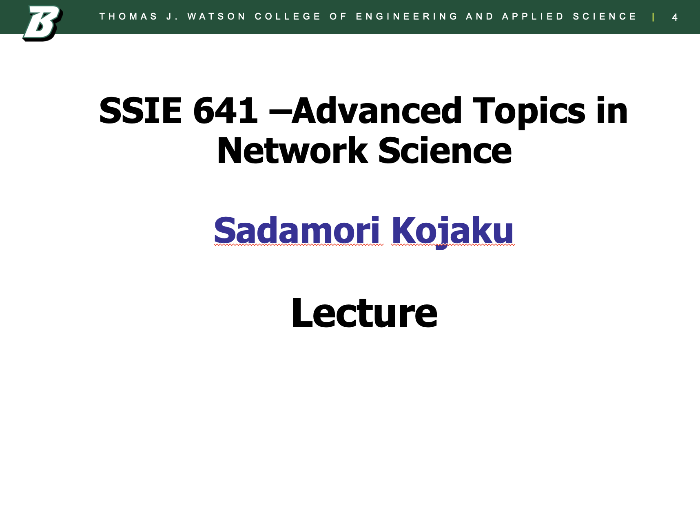
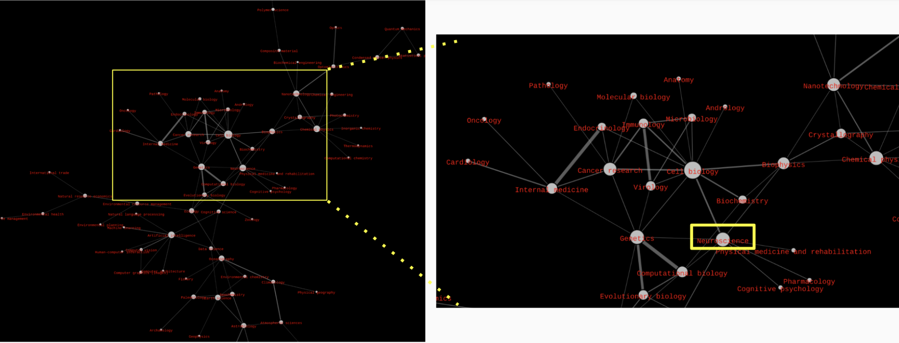
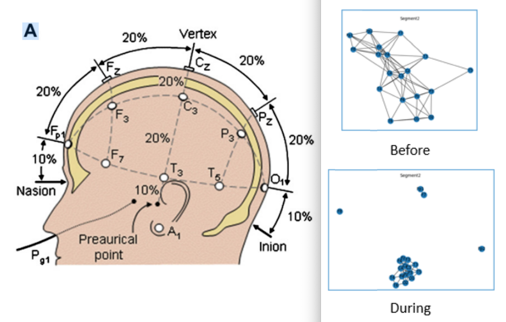
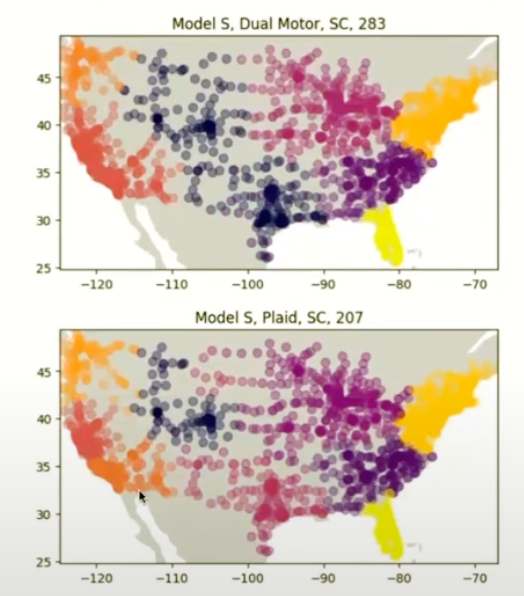

Check list
- [ ] Microphone turned on
- [ ] Zoom room open
- [ ] MyBinder launched
- [ ] Sound Volume on

---

# Advanced Topics in Network Science

Lecture 01: Introduction & Seven Bridges of Königsberg
Sadamori Kojaku

---

---

---

---

---

# Course Overview

- **Instructor:** Sadamori Kojaku (幸若完壮)
- **Email:** skojaku@binghamton.edu
- **Office Hours:** Tue & Thu 14:30-16:30
- **Course Website:** https://skojaku.github.io/adv-net-sci

---

# What is Network Science?
- What is ***Network***?
- Why do should we care about ***Network***?
- What is ***Network Science***?

---

# Find networks around you!

🦁🐘🐒 [My zoo of networks](https://skojaku.github.io/adv-net-sci/intro/zoo-of-networks.html) 🐼🦒🦓

---

# Is it just a branch of graph theory?

• 📐 Graph Theory:
  - Focuses on structured graphs (trees, grids, regular graphs)
  - Emphasizes mathematical properties

• 🌐 Network Science:
  - Studies complex networks in real-world systems
  - "Complex" ≠ "Complicated"
  - Seeks simple laws to explain seemingly intricate structures

---

# How is it different from data science?

• 📊 **Data Science: 1 + 1 = 2**
  - Often assumes independence between data points (i.i.d.)
  - Focuses on extracting insights from structured data

• 🌐 **Network Science: 1 + 1 > 2**
  - Embraces dependencies between entities
  - Recognizes that real-world systems are often interconnected
  - Analyzes how these connections influence system behavior

---

# Course Objectives

We will:
- 📊 Analyze networks
- 🧠 Learn key concepts
- 🤖 Apply AI to networks

After this course, you'll be able to:
- 📚 Understand network science papers
- 💻 Do advanced network analysis
- 🔬 Design network research
- 🔗 Connect Systems Science and networks

---

# Philosophy of Learning in this course

https://www.youtube.com/watch?v=RQaW2bFieo8

---

---

# Course Structure

"Don't think! Feeeeeel" - Bruce Lee

- 🎓 Lectures
- 🛠️ Hands-on exercises
- 📝 Weekly quizzes
- 💻 Biweekly coding assignments
- 🎓 Final project
- 📝 Exam

---

# Final Project 🎓

- Individual project (30% of grade) 📊
- Timeline 📅
  - Proposal: Sept 29; Paper: Dec 4; Presentations: Dec 8

- Requirements 📋
  - Apply concepts to real problem 🌍
  - Analyze network dataset 🔬
  - Show course integration 🧠
  - Clear presentation 🗣️

---

# Example Project 01

---

# Example Project 02

---

# Example Project 03

Tesla Supercharger Network

---

# Exam

- 📚 Final exam on all topics (weight: 30%)
- 📅 During exam week (Dec 9-13)
- 📝 Theory + practical problems
- 🌍 Apply concepts to real scenarios
- 📚 Review sessions before exam

---

# Weekly Quiz on Brightspace

- 📊 Quizzes: A tool to identify misconceptions (weight: 20%)
- 🧠 Covers previous week's topics
- 🏁 Deadline: before final exam
- 🔄 Unlimited attempts until correct

---

# Assignment

- 📅 Roughly bi-weekly (weight: 20%)
- 💻 Coding exercises
- 🤖 Autograded assignments
- 🏁 Deadline: before final exam
- 🔄 Unlimited attempts until correct

---

# Lecture note

- 📚 [Interactive Jupyter book](https://skojaku.github.io/adv-net-sci)
- 💻 Run code directly on the page
  - ⏳ First-time loading may take 2-3 mins
- 🔄 Or download as Jupyter notebook
  - ☁️ Use on cloud (Google Colab, Kaggle) or locally
  - 📦 Install packages from `environment.yml` for local use
  - See [The course GitHub repo](https://github.com/skojaku/adv-net-sci/) for details

---

# Policy

- 📚 3-credit course: 6.5+ hours of work/week outside class
- 🤖 AI tools allowed for learning, but cite if used in assignments
- 💾 Back up all data and code (loss not an excuse for late work)
- ♿ Accommodations available for students with disabilities
- 🚫 Zero tolerance for academic dishonesty

---

# Questions?

---

# Before we start
What motivates you to take this course (if you want to)?

https://www.youtube.com/watch?v=u6XAPnuFjJc

~8:23

---

# M01: Seven Bridges of Königsberg

---

# The Königsberg Bridge Puzzle 🌉

- 18th century puzzle in Königsberg, Germany 🇩🇪
- City had 7 bridges connecting 2 islands and mainland 🏙️
- **Challenge**: Find a route that crosses each bridge exactly once 🚶‍♂️

---

# Find a route that crosses each bridge exactly once 🚶‍♂️

How would you approach this problem?

---

# Euler's Brilliant Solution 🧠

- 🏙️ Simplified city to network of landmasses and bridges
- 🔗 Focused on connections, not layout

---

# Pen and Paper Exercise 📝

- Let's work on a pen-and-paper [exercise](http://estebanmoro.org/pdf/netsci_for_kids/the_konisberg_bridges.pdf) 📄
- Let's form a group of 3-4 people and discuss the solution together.

---

# Euler's Solution 🧠

- 🧮 Euler considered: even vs odd edge nodes
- 💡 Key insights: Even - enter/leave k times, Odd - one edge left
- 🏆 **Euler's Theorem**: Path exists if all even degree or two odd degree
- 🌉 Königsberg: All odd degree, no Euler path

---

# Aftermath: The Bridges' Fate 🏙️💣

- 🇷🇺 During World War II, Soviet Union bombarded Königsberg
- 💥 Two of the seven bridges were destroyed
- ✅ Ironically, this destruction made an Euler path possible!

---

# 💻 Coding Time: Networks in Code! 🌐

[Let's represent networks with Python!](https://skojaku.github.io/adv-net-sci/m01-euler_tour/how-to-code-network.html) 🐍

---

# Key Takeaways

- Networks are powerful tools for modeling complex systems
- Euler's path problem: a foundation of graph theory and network science
- Python for network analysis

---

# Any questions?