

<!-- Two-column layout -->
<!-- 

# Left Side
- Point 1
- Point 2

# Right Side

This is a note in the right column

 -->

Check list
- [ ] Microphone turned on
- [ ] Zoom room open
- [ ] MyBinder launched
- [ ] Sound Volume on

---

# SSIE 419/519: Applied Soft Computing

Lecture 02: Introduction & Word Embeddings

Sadamori Kojaku

---

---

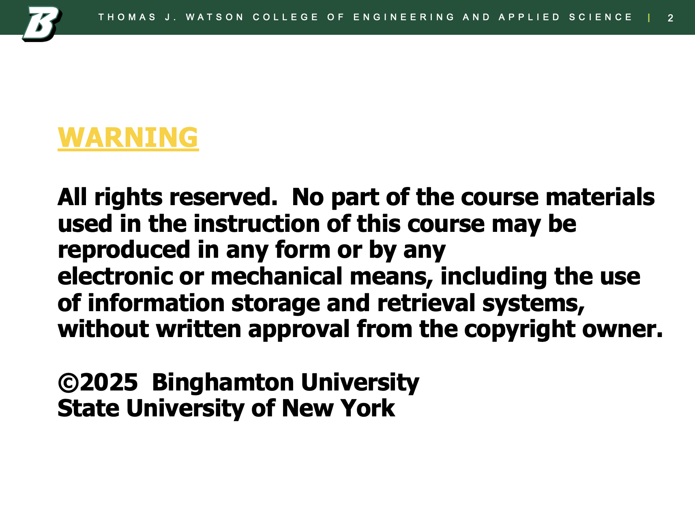

---

---

# Overview
- Recurrent Neural Networks (RNN)
- Long Short-Term Memory (LSTM)
- Embeddings from Language Models (ELMo)
- Sequence-to-Sequence (Seq2Seq)
- Attention Mechanisms

---

## **The Core Idea of RNNs** 💡

- **Intuition**:
  Neural Network + a working memory
- **Working memory**:
  Represented as a vector $h_t$ of a fixed size
- **Update & Output**:
  $$
  \begin{aligned}
    h_t &= f(h_{t-1}, x_t)\\
    o_t &= g(h_t)
  \end{aligned}
  $$
    - $h_{t-1}$: previous hidden state
    - $x_t$: current input
    - $f$: memory update function
    - $o_t$: output
    - $g$: output function

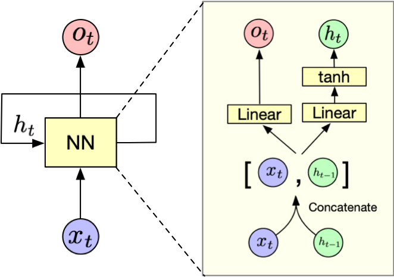

---

## [RNN Hands on](https://skojaku.github.io/applied-soft-comp/m02-recurrent-neural-network/rnn-mapping-challenge.html)

---

## **RNN Forward Pass & Unrolling** ➡️

- **Unrolled view**:
  RNN can be seen as a deep network with many copies of the same layer

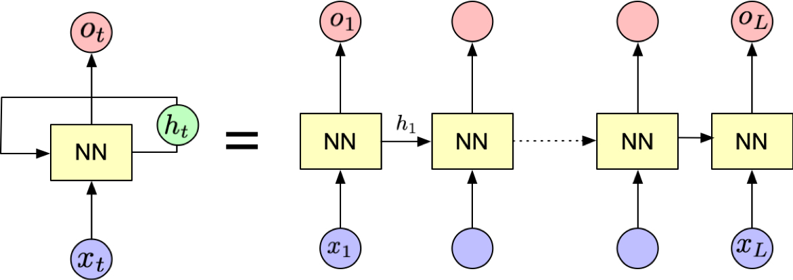

- **Backpropagation Through Time (BPTT)**:
  The gradient is backpropagated backward through time

---

### How to tra️in RNN

- **Unrolled view**:
  RNN can be seen as a deep network with many copies of the same layer

- **Backpropagation Through Time (BPTT)**:
  The gradient is backpropagated backward through time

- We train an RNN with parameter $W$ to minimize objective ${\cal L}$.
- ${\cal L}$ is a function of the last output $o_{T}$ from RNN at time $T$ (e.g., MSE).
- Update the weight based on the gradient:

  $$
  W := W - \underbrace{\eta}_{\substack{\text{learning} \\ \text{rate}}} \;\;\underbrace{\frac{\partial \mathcal{L}}{\partial W}}_{\text{gradient}}
  $$

  Because $W$ is reused at each time step, we need to accumulate gradients.

  $$
  \frac{\partial L}{\partial W} = \sum_{t=1} ^T \frac{\partial \cal L}{\partial h_t}\frac{\partial h_t}{\partial W}
  $$

---

### How to tra️in RNN (cont.)

Using the chain rule, we can calculate how changes in a hidden state $h_t$ affect the final loss $\cal L$:

$$
\frac{\partial \cal L}{\partial h_t} = \frac{\partial \cal L}{\partial o_{T}}  \frac{\partial o_{T}}{\partial h_{T}} \frac{\partial h_T}{\partial h_{T-1}} \cdots \frac{\partial h_{t+1}}{\partial h_t}
$$

where:

- $\dfrac{\partial \cal L}{\partial o_t}$ shows how the loss changes with the output
- $\dfrac{\partial o_T}{\partial h_T}$ captures how the hidden state influences the output

Compute the gradient:

$$\frac{\partial {\cal L}}{\partial h_{1}}$$

for the following setting:
- $T=2$
- ${\cal L} = (y_T - o_T)^2$
- $o_t = w_1 h_t$
- $h_t = \tanh(w_2 x_t + w_3 h_{t-1})$

**Hint**: $\partial \tanh(x) / \partial x = 1 - \tanh(x)^2$

---

First, using the chain rule:
$\dfrac{\partial {\cal L}}{\partial h_1} = \dfrac{\partial {\cal L}}{\partial o_2} \dfrac{\partial o_2}{\partial h_2} \dfrac{\partial h_2}{\partial h_1}$

Let's solve each term:
- $\dfrac{\partial {\cal L}}{\partial o_2} = -2(y_2 - o_2)$
- $\dfrac{\partial o_2}{\partial h_2} = w_1$
- $\dfrac{\partial h_2}{\partial h_1} = w_3(1-\tanh^2(w_2 x_2 + w_3 h_1))$

Putting it all together:

$$
\begin{align*}
\dfrac{\partial {\cal L}}{\partial h_1} &= -2(y_2 - o_2)w_1w_3 \\ & \times (1-\underline{\tanh}^2(w_2 x_2 + w_3 h_1))
\end{align*}
$$

---

## **Vanishing Gradient Problem** 📉

- Gradients shrink (or explode) through many time steps
- *Example* :
    - If $\tanh(x) = 0.5$ and $T=10$, then the gradient is reduced by a factor of $(0.25)^{10} \approx 0.0000001$

An RNN forgets some bits of information through time, and the final state becomes effectively independent of early inputs, leading to nearly zero gradients for them.

## **Gradient Clipping**

- Normalize the gradient to have a fixed norm.
- Example (clipping by norm):
  If the gradient norm exceeds a threshold $\alpha$, scale parameters by dividing by their norm:
  $$
  w_i \leftarrow \alpha \frac{w_i}{\sqrt{\sum_j w_j^2}}
  $$

---

# [Demo: Training an RNN with PyTorch](https://skojaku.github.io/applied-soft-comp/m02-recurrent-neural-network/reccurrent-neural-net.html)

---

# **LSTM (1)**

- In a simple RNN, we let a neural network to figure out how to structure and update the memory (hidden state) 🧠
  - Not easy for a neural network to learn how to do this from scratch
- We can introduce a structure to learn how to update the memory (hidden state) 🔄
- What are the key operations in human memory systems? 🤔

---

# **LSTM (2)**

- Memory operations 🧠:
  - **Forget** 🗑️: discard old info
  - **Add** ➕: store new info
  - **Retrieve** 🔍: access stored info

- Memory types 💭:
  - **Long-term** 📚: knowledge & experiences
  - **Short-term** 💡: current processing

---

# **LSTM (3)**

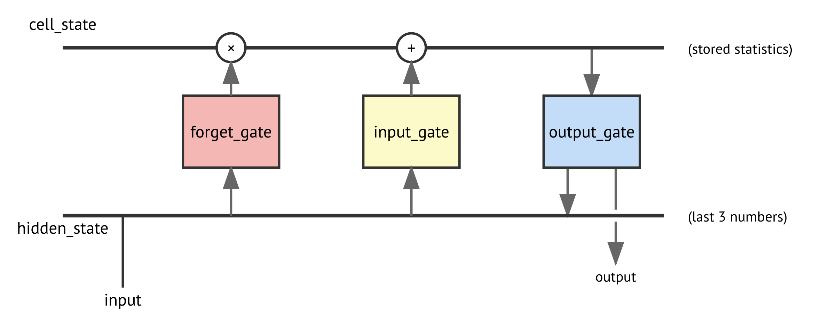

---

# **LSTM (4)**

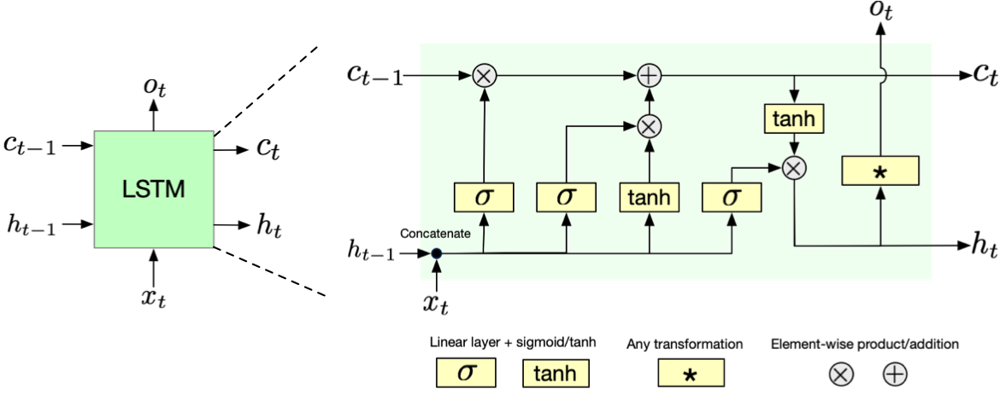

---

# **LSTM (5)**

**Forget Gate**
Decides what to forget from cell state

$$
f_t = \sigma(W_f \cdot [h_{t-1}, x_t] + b_f)
$$

- Simoid $\sigma$ squashes values between 0 and 1
- $W_f$ and $b_f$ are learnable parameters
- $h_{t-1}$ and $x_t$ are the inputs

Think of it as a filter 🧠 that looks at previous ($h_{t-1}$) and new ($x_t$) info, deciding what to keep (1) or forget (0).

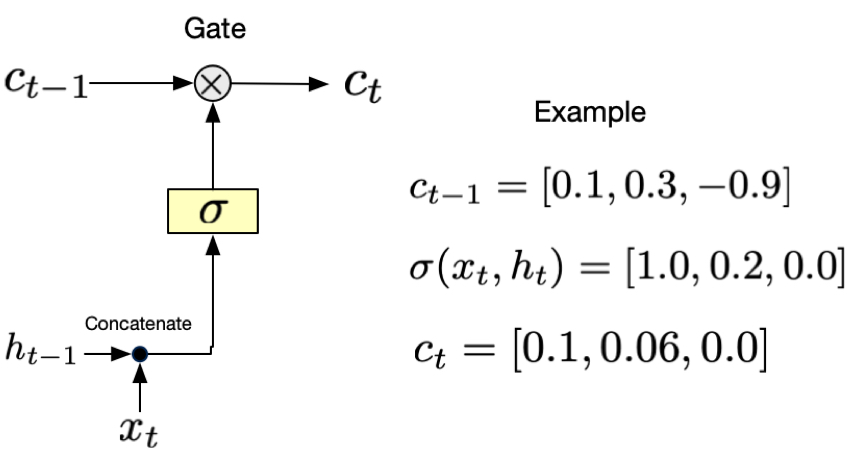

---

# **LSTM (6)**

**Input Gate**
Decide what new information to store in cell state.

$$
C_t = \underbrace{i_t}_{\substack{\text{Filter}}} \underbrace{\odot}_{\substack{\text{Element-wise} \\ \text{multiplication}}} \underbrace{\tilde{C}_t}_{\substack{\text{Candidate update}}}
$$

Where the candidate update:

$$
\tilde{C}_t = \tanh(W_c[h_{t-1}, x_t] + b_c)
$$

And filter:

$$
i_t = \sigma(W_i \cdot [h_{t-1}, x_t] + b_i)
$$

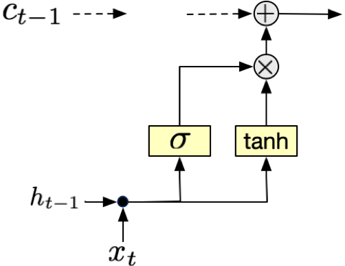

---

# LSTM (7)

**Output Gate**
Decides what to output from the cell state.

$$
o_t = \sigma(W_o \cdot [h_{t-1}, x_t] + b_o)
$$

- Sigmoid $\sigma$ squashes values between 0 and 1
- $W_o$ and $b_o$ are learnable parameters
- $h_{t-1}$ and $x_t$ are the inputs

and the hidden state is updated as:

$$
h_t = o_t \odot \tanh(C_t)
$$

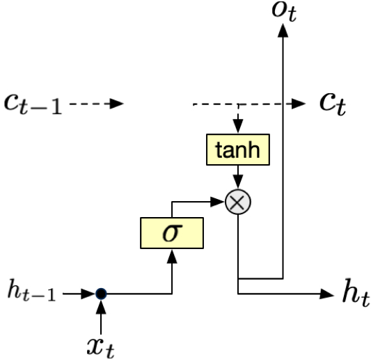

---

# LSTM (8)

Putting it all together:

**Cell State Update**

$$ C_t = f_t \odot C_{t-1} + i_t \odot \tilde{C}_t $$

**Hidden State Update**

$$ h_t = o_t \odot \tanh(C_t) $$

**Gates**

$$ f_t = \sigma(W_f[h_{t-1}, x_t] + b_f) $$
$$ i_t = \sigma(W_i[h_{t-1}, x_t] + b_i) $$
$$ o_t = \sigma(W_o[h_{t-1}, x_t] + b_o) $$

---

# [Interactive Notebook: Memory Challenge](https://skojaku.github.io/applied-soft-comp/m02-recurrent-neural-network/memory-challenge.html)

---

# Key advantage of LSTM

LSTM mitigates the problem of gradient vanishing problem. To see this, let us calculate:

$$
\frac{ {\partial C}_{t}}{\partial C_{t-1}}
$$

where:

$$
C_{t} = f_{t} \odot C_{t-1} + i_{t} \odot \tilde{C}_{t}
$$

- $f_t$ is the forget gate
- $i_t$ is the input gate
- $\tilde{C}_t$ is the candidate update
- $\odot$ is the element-wise product

---

The derivative of the cell state is:

$$
\frac{ {\partial C}_{t}}{\partial C_{t-1}} = f_t
$$

where $f_t$ is time-varying but controlled by the forget gate. If the long-term memory is useful for the task, LSTM can easily retain the memory by setting $f_t$ to 1.

For RNN with $h_t = \tanh(W h_{t-1} + U x_t + b)$, the derivative of the hidden state is:

$$
\frac{ {\partial h}_{t}}{\partial h_{t-1}} = \text{diag}(1 - h_{t}^2) W.
$$

- When $h_t ^2 \simeq 1$ (which is the case when $h_t \gg 0$ or $h_t \ll 0$ ), the gradient vanishes.

---

> (Cont) For RNN with $h_t = \tanh(W h_{t-1} + U x_t + b)$:
> $$
> \frac{ {\partial h}_{t}}{\partial h_{t-1}} = \text{diag}(1 - h_{t}^2) W.
> $$

- Even if $h_t ^2 \simeq 0$, the gradient can still vanish or explode. To see this, notice that $W$ is time-invariant, and multiplied many times through backpropagation (cont). To simplify, let us assume $h_t = 0$ for all $t$. Then the gradient is:

$$
\frac{\partial \cal L}{\partial h_t} = \frac{\partial \mathcal{L}_t}{\partial h_t} + W^T \frac{\partial \mathcal{L}_{t+1}}{\partial h_{t+1}} + (W^T)^2 \frac{\partial \mathcal{L}_{t+2}}{\partial h_{t+2}} + \dots + (W^T)^{T-t} \frac{\partial \mathcal{L}_T}{\partial h_T}
$$

- The gradient magnitude depends on the spectrum radius $\rho$ of $W$ (its largest eigenvalue in absolute value). When this radius exceeds 1, the gradient explodes, and vice versa.
- Only when $\rho(W)=1$, the gradient does not vanish or explode, which is hard to achieve unless we constrain $W$ to be so.

---

# Another issue: Overfitting

- Simple RNN with $D_h$ dimensional hidden state and $D_i$ dimensional input:
   - Weight matrix for hidden state update: $D_h \times (D_h + D_i)$
   - Bias term: $D_h$
   - Total parameters: $D_h(D_h + D_i + 1)$
- For LSTM:
  - Three gates (input, forget, output) + (candidate cell state generation)
  - Each has a weight matrix of size $D_h \times (D_h + D_i)$ and bias term of size $D_h$
  - Total parameters: $4D_h(D_h + D_i + 1)$

  - Large number of parameters can lead to overfitting

- LSTM has more parameters, more expressiveness, and thus is more prone to overfitting.

---

# **Dropout Regularization**

- Randomly "drop" (set to 0) some neurons during training
- Forces network to be redundant, more robust
- Prevents the model to be dependent on a few neurons

During inference (testing), we don't drop any neurons but scale outputs by $p$ to maintain expected value.

---

# GRU (Gated Recurrent Unit)

- A simplified version of LSTM
- Less parameters and easier to train
- But less powerful than LSTM

GRU has only the hidden state $h_t$.

---

# Stacked LSTM

- Multiple LSTM layers stacked vertically
- Each layer's hidden state becomes input for the next layer
- **Progressive Abstraction**:
  - Each layer learns increasingly complex temporal representations
  - Lower layers capture concrete, local patterns (e.g., basic syntax, immediate trends)
  - Higher layers transform local features into abstract patterns

---

### **Embedding from Language Models (ELMo)** 🪄

- Generate *contextualized* word embeddings:
  - Example: “Bank” in finance vs. “bank” of a river. word2vec assigns the same embedding to both. ELMo assigns different embeddings to each based on the context
- Stacked *Bidirectional* LSTMs that read words in both directions
- Character-level CNN: handle out-of-vocab words
- State-of-the-art before Transformer

---

[**Demo**: LSTM](https://skojaku.github.io/applied-soft-comp/m02-recurrent-neural-network/lstm.html)

---

# **Sequence-to-Sequence (Seq2Seq)** ➡️

- *For translation, summarization, Q&A…*
- **Encoder**: reads input, outputs “context vector”
- **Decoder**: uses that context to generate new sequence
- [SOS] (Start of Sequence) token is used to indicate the beginning of the sequence for the decoder

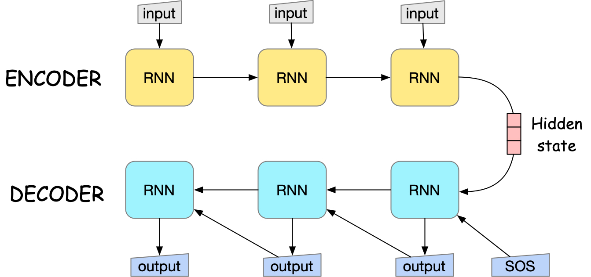

---

## The hidden state of the encoder represents a "summary" of the input sequence.

(Taken from Sutskever, I. (2014). Sequence to Sequence Learning with Neural Networks. arXiv preprint arXiv:1409.3215.)

---

# Issue of Seq2Seq

- Single “bottleneck” vector is limiting for long inputs

---

# **Attention Mechanism** 👀
## *"Paying Focus Where It Matters"*

- Instead of a single context vector, **look** at all encoder states
- The decoder decides which parts to focus on each time step
- **Analogy**: A translator re-checks specific words in the source sentence as needed.

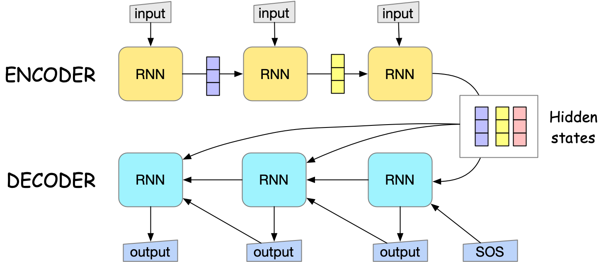

---

# **How Attention Works** 🔍

1. **Compute score**: $e_{tj} = f(h_t, h_j^{\text{enc}})$
  - $h_t$: the hidden state of the decoder at time $t$
  - $h_j^{\text{enc}}$: the hidden state of the encoder at time $j$
  - $f$: a function that computes the score (multilayer perceptron)

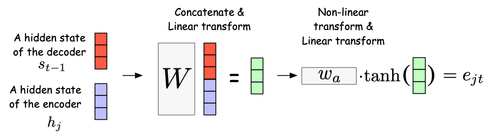

---

2. **Normalize** $e_{tj}$ by softmax to get attention $\alpha_{tj}$ that sums to 1, i.e., $\sum_j \alpha_{tj} = 1$
3. **Context Vector**:

   $$
    c_t = \sum_j \alpha_{tj} \, h_j^{\text{enc}}
   $$

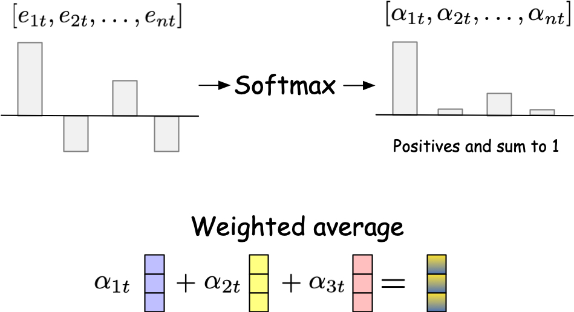

---

## Example: Attention map

- Taken from the original paper: Bahdanau, D., Cho, K., & Bengio, Y. (2014). Neural Machine Translation by Jointly Learning to Align and Translate. CoRR, abs/1409.0473.
- English-French translation

---

# **Attention**:
- Helps with **long-range** relationships
- Improves **interpretability** (which words are relevant?)
- Opened the door to **Transformers** (self-attention)

---

# **Conclusion & Next Steps** 🎉

- **RNN**: first step for sequential data
- **LSTM**: gating for long-term memory
- **ELMo**: dynamic embeddings sensitive to context
- **Seq2Seq + Attention**: break free from bottleneck, focus on relevant parts

**Beyond**:
- **Transformers** (GPT, BERT)
- Large Language Models
- Advanced optimization & regularization