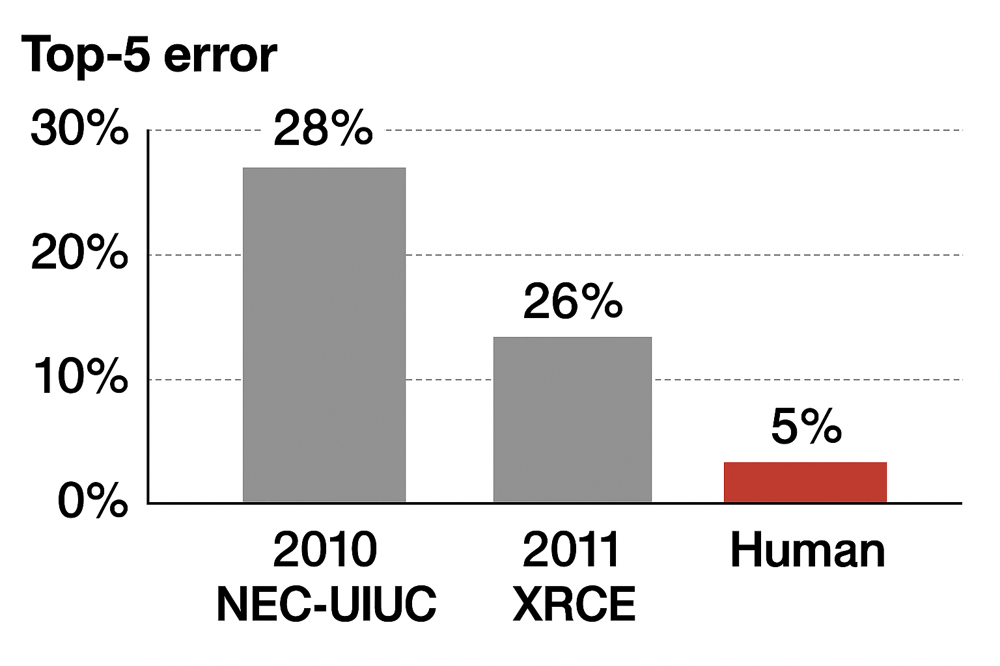

# Image Processing 🧠

---

# Early Success of LeNet

- LeNet demonstrated the first success of neural networks in image classification
- Despite its success, there was a 20-year period of *winter* of neural networks
- ...until AlexNet's breakthrough in 2012

---

# The Winter of Neural Networks ❄️

- Neural networks couldn't scale beyond shallow architectures
- **Vanishing gradients** made deeper models untrainable
- **Compute bottlenecks** limited experimental depth
- Classical methods (SVMs, random forests) outperformed on benchmarks

By the 2000s, neural nets were largely abandoned for practical tasks.

[See the "Table of Contents" of the 2011 version of a well-known computer vision textbook](https://www.cs.bilkent.edu.tr/~s.rahimzadeh/SzeliskiBook_20100903_draft.pdf)

---

# Other reasons for the winter of neural networks 🧠🚫

- Statistical learning emphasized **interpretable, convex models**
- Neural nets seen as empirical, black-box, unprincipled
- **Peer review and grants** favored theory-heavy approaches
- Tooling was fragmented, poorly documented, and hard to scale

---

# Feature Engineering Era 🛠️

- Common pipeline:
  1. **Handcrafted features**: SIFT, HOG, LBP
  2. Dimensionality reduction: PCA, LDA
  3. Classifier: SVM, Random Forest, k-NN

- Image Recognition $\simeq$ Feature Engineering problem

- If you have good features, you can improve image recognition performance

---

# Two missing pieces for deep learning 🧩

---

# Data 🧩

- Before 2006: Progress in computer vision was bottlenecked by small, narrow datasets.
- Fei-Fei Li (when she was at U. Illinois Urbana-Champaign) proposed a radical idea: **build a dataset as large and varied as the real world**, called **ImageNet**.
- She led a team to build ImageNet, a dataset of 14 million images across 20,000 categories.

---

# How ImageNet was built 🗂️🖼️

1. **Choose Categories**
   - Used **WordNet** hierarchy for organization (e.g., "Siberian husky" → "dog" → "animal" → "entity")
2. **Collect Images**
   - Gathered images from web searches (~1000-2000 images per category)
3. **Verify Images**
   - Amazon Mechanical Turk workers checked images (simple yes/no verification process)
4. **Clean Dataset**
   - Removed duplicates and poor quality images

---

# From Dataset to Benchmark – ILSVRC 📊

- 2010: ImageNet team launched **ILSVRC**, a yearly classification challenge.
- Focused subset: 1,000 categories, 1.2M images.
- Defined the **state of the art** in vision.

---

# [👉 ILSVRC is very tough ...](https://image-net.org/challenges/LSVRC/2012/analysis/#cmp_pascal_div)

---

# Only 2% improvement in one year

---

# In 2012, one algorithm sets the deep learning revolution

---

## AlexNet's Performance Leap (2012)

- **16.4% top-5 error**, down from ~25% the previous year
- A neural network with 8 layers, 60M parameters, trained on two GPUs

---

# AlexNet: A Breakthrough in Deep Learning

- Alex Krizhevsky, Ilya Sutskever, Geoffrey Hinton (2012)
- Sparked the modern deep learning revolution

---

# Key architectural and training innovations
  1. ReLU activation
  2. Dropout regularization
  3. Local response normalization
  4. GPU-parallel training

---

# Innovation 1: ReLU Activation 🧮

- ReLU was introduced in 2010 by Hinton's group
- **Sigmoid**:
  $$\sigma(x) = \frac{1}{1 + e^{-x}}$$

  - Saturates for large $|x|$, slows learning
- **ReLU**:
    $$\text{ReLU}(x) = \max(0, x)$$
  - Linear for $x > 0$, zero otherwise
  - Preserves gradients, speeds up training

---

# ReLU Variants – Leaky & PReLU

- Problem: ReLU units can **"die"** if $x$ stays negative
- Fix:
  - **Leaky ReLU**: small slope for $x \leq 0$
  - **PReLU**: slope $\alpha$ is learnable

$$
f(x) = \begin{cases}
x & \text{if } x > 0 \\
\alpha x & \text{if } x \leq 0
\end{cases}
$$

- [👉 Interactive visualization of activation functions](https://dashee87.github.io/deep%20learning/visualising-activation-functions-in-neural-networks/)

---

# Innovation 2: Dropout Regularization

- **Large networks overfit easily** without constraint
- Dropout: randomly deactivate neurons with probability $p$ during training
- At inference, all units active but scaled by $(1-p)$
- Encourages redundancy and robustness

---

# Innovation 3: Local Response Normalization

## What is normalization?

- **Normalization ~ Standardization of the pixel values**

- Without normalizations, models may learn to rely on the scale of the pixel values.

- A simple normalization: The whitening of the pixel values

---

### **Local Response Normalization (LRN)**

- Channels indexed $1, 2, 3, \dots, C$
- Normalizes each activation by **neighboring channels**:

$$
b^i_{x,y} = \frac{\underbrace{a^i_{x,y}}_{\text{activation}}}{\underbrace{\left(\underbrace{k}_{\text{bias}} + \underbrace{\alpha}_{\text{scale}} \underbrace{\sum_{j = i - n/2}^{i + n/2} (a^j_{x,y})^2}_{\text{sum over nearby channels}}\right)}_{\text{normalization factor}} ^\beta}
$$

- Suppresses redundant activations and noise

---

LRN was introduced in AlexNet but later fell out of use—BatchNorm proved more effective and efficient.

---

# AlexNet Architecture Overview 🧱

  

    <ol style="font-size: 0.9em;">
      <li><strong>Input</strong>: 224×224 RGB image</li>
      <li><strong>Conv1</strong>: 11×11, stride 4 → ReLU → LRN → MaxPool</li>
      <li><strong>Conv2</strong>: 5×5, stride 1 → ReLU → LRN → MaxPool</li>
      <li><strong>Conv3–5</strong>: 3×3 convolutions with ReLU</li>
    </ol>
  

  

    <ol start="5" style="font-size: 0.9em;">
      <li><strong>MaxPool</strong> after Conv5</li>
      <li><strong>FC6</strong>: 9216 → 4096 → ReLU → Dropout</li>
      <li><strong>FC7</strong>: 4096 → 4096 → ReLU → Dropout</li>
      <li><strong>FC8</strong>: 4096 → 1000 → Softmax</li>
    </ol>
  

---

 AlexNet splits its convolutional layers into two parallel paths. This is due to a hardware limitation at the time. What motivated this architectural choice? 

---

Memory Constraints: GPUs in 2012 had limited memory (~3GB). Splitting the network reduced the memory burden on each GPU.

Parallel Computation: Running two paths in parallel accelerated training by distributing the workload.

---

- Left: ILSVRC-2010 test images and the five labels considered most probable by the model
- Right: ILSVRC-2010 test images in the first column. The remaining columns show the six training images that produce feature vectors in the last hidden layer with the smallest Euclidean distance from the feature vector for the test image.

---

# Legacy of AlexNet 🌍

- Paved the way for deep learning to dominate CV and beyond
- Inspired architectures: VGG, GoogLeNet, ResNet
- Shifted the field from handcrafted to learned representations
- Validated empirical, data-driven progress over hand-tuned features