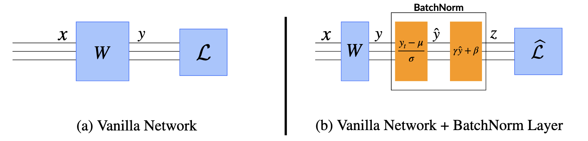

# Image Processing 🧠

 <!-- Example AlexNet Diagram -->

---

# Success of GoogLeNet

- **The success of GoogLeNet and VGG** shows that *depth* is important.
  - VGG: 19 layers, GoogLeNet: 22 layers
- **Larger networks always perform better 😎**

## Well It all makes sense, right?

---

# But it is not that simple! 🤔

## **Paradoxically, deeper networks beyond 20 layers showed *higher* training error than shallower ones.**

---

# What's the problem?

- In theory, deeper networks are more powerful and expressive.
- In practice, not!
- Two problems:
  - **Degradation Problem:** Training becomes unstable and harder.
  - **Vanishing/Exploding Gradients:** Error signals struggle to propagate back through many layers, even with ReLU and auxiliary classifiers.
- Note that this is not because of overfitting but more fundamental issues.

*Shouldn't deeper networks, with more capacity, learn *at least* as well as shallower ones?*

---

# A remedy for the degradation problem ~ Batch Normalization

---

center

---

<!-- Slide 2 -->
# Internal Covariate Shift

**What is it?**
 The distribution of a layer's inputs changes during training because the parameters of preceding layers are constantly changing.

**Why is it bad?**
1.  **Slows Training:** Each layer must adapt to a shifting input distribution.
2.  **Requires Careful Initialization:** Networks become very sensitive to the initial weights.
3.  **Needs Lower Learning Rates:** High learning rates can amplify the shifts, causing gradients to explode or vanish.

---

# The Core Idea: Normalize Activations 💡

**How?**
For *each feature* (channel) independently normalize the activations within the **current mini-batch** to have **zero mean** and **unit variance**.

---

<blockquote class="twitter-tweet">
Timely paper from <a href="https://twitter.com/ShibaniSan?ref_src=twsrc%5Etfw">@ShibaniSan</a>, Dimitris Tsipras, <a href="https://twitter.com/andrew_ilyas?ref_src=twsrc%5Etfw">@andrew_ilyas</a> , and <a href="https://twitter.com/aleks_madry?ref_src=twsrc%5Etfw">@aleks_madry</a> providing some new insights into why batch norm works. They perform a number of clever experiments to work it out, finding that internal covariate shift is a red herring! <a href="https://t.co/fJV4DjagW5">https://t.co/fJV4DjagW5</a> <a href="https://t.co/G20yf9pMeJ">pic.twitter.com/G20yf9pMeJ</a>
&mdash; Ari Morcos (@arimorcos) <a href="https://twitter.com/arimorcos/status/1001856542268952576?ref_src=twsrc%5Etfw">May 30, 2018</a></blockquote> 

---

<!-- Slide 4 -->
# How Batch Norm Works (During Training) ⚙️

For a mini-batch $B = \{x_1, ..., x_m\}$ and a specific activation feature:

1.  **Calculate Mini-Batch Mean and Variance:**
    $$ \mu_B = \frac{1}{m} \sum_{i=1}^{m} x_i, \quad \sigma_B^2 = \frac{1}{m} \sum_{i=1}^{m} (x_i - \mu_B)^2 $$
3.  **Normalize:** (Add small epsilon $\epsilon$ for numerical stability)
    $$ \hat{x}_i = \frac{x_i - \mu_B}{\sqrt{\sigma_B^2 + \epsilon}} $$
4.  **Scale and Shift:** Introduce learnable parameters $\gamma$ (scale) and $\beta$ (shift).
    $$ y_i = \gamma \hat{x}_i + \beta $$

*   $\gamma$ and $\beta$ are learned during backpropagation just like weights.
*   Applied independently to each feature/channel dimension.

---

# Does this remind you of something?

Batch normalization
$$ \hat{x}_i = \frac{x_i - \mu_B}{\sqrt{\sigma_B^2 + \epsilon}}$$

---

<!-- Slide 5 -->
# Why Scale and Shift? (Gamma γ & Beta β) 🤔

If we just normalized to zero mean/unit variance, why add learnable scale (gamma) and shift (beta) parameters?

Batch Normalization

$$ \hat{x}_i = \frac{x_i - \mu_B}{\sqrt{\sigma_B^2 + \epsilon}}$$

---

Always normalizing to zero mean and unit variance could **restrict what the network can learn**.

* Some activation functions work better with inputs in specific ranges.
* **$\gamma$ and $\beta$ let the network adjust the scale and shift as needed.**
* If helpful, the network can even learn to undo normalization completely.
* This gives the model more flexibility to find optimal representations.

---

<!-- Slide 5 -->
# Do you remember?

Do you remember how to compute the mean and variance parameter?

Batch Normalization

$$ \hat{x}_i = \frac{x_i - \mu_B}{\sqrt{\sigma_B^2 + \epsilon}}$$

---

# How would you compute them for inference?

During inference, we often process images *one by one* (or in small, non-representative batches). How would you compute the mean and variance parameters?

Batch Normalization

$$ \hat{x}_i = \frac{x_i - \mu_B}{\sqrt{\sigma_B^2 + \epsilon}}$$

---

*   During training, BN layers maintain **running averages** of the mean ($\mu$) and variance ($\sigma^2$) across *all* mini-batches seen so far.
    *   `running_mean = momentum * running_mean + (1 - momentum) * batch_mean`
    *   `running_var = momentum * running_var + (1 - momentum) * batch_var`
*   At **inference time**, use these fixed, *population* statistics ($\mu_{pop}, \sigma^2_{pop}$) instead of mini-batch statistics for normalization:
    $$ \hat{x} = \frac{x - \mu_{pop}}{\sqrt{\sigma_{pop}^2 + \epsilon}} $$
    $$ y = \gamma \hat{x} + \beta $$
*   The learned $\gamma$ and $\beta$ are still used.

---

# Placement of Batch Norm Layer 📍

- Common practice: Apply BN **after** the Convolutional or Fully Connected layer and **before** Activation function (e.g., ReLU).
- Variation exists! (such as BN after activation)

---

# A remedy to vanishing gradient problem ~ Skip-connections

---

# ResNet

* A simple but transformitive idea: adding a direct connection from the input to the output (a.k.a. **skip-connection**)

*   Enabled training of *extremely* deep networks (50, 101, 152+ layers).
*   Overcame the **vanishing gradient** and **degradation problems**.
*   One of the most influential deep learning innovations.

---

# The Core Idea: Residual Learning 💡

- **Key idea**:
From multiplicative to additive transformations

- Formula:
  From $y = F(x)$ to $y = F(x) + x$, where $F$ is a neural net.

The network learns the **difference** needed, adding it back to the original input via a **skip connection**.

---

# Why Residual Connections Work?

---

# Reason #1: Easier Optimization via Identity Mapping ✅

- **Identity mapping** maps data $x$ to $x$ itself.
- Identity mapping is hard to learn for *multiplicative* transformation but easy for *additive* transformation.
  - Often the weights in neural nets are initialized to be close to zero.
  - In the additive case, the default is close to identity mapping!

* $F(\mathbf{x})$ can still learn complex transformations if needed.

---

# Reason #2: Better Gradient Flow 🌊

Let's consider two layers with skip connections:

$$ y = F(x) + x $$

and

$$z = G(y) + y$$

Derive the gradient of $z$ with respect to $x$.

---

$$
\frac{\partial z}{\partial x} = \frac{\partial G(y)}{\partial y}\frac{\partial F(x)}{\partial x} + \frac{\partial G(y)}{\partial y} + \frac{\partial F(x)}{\partial x} + 1
$$

How many terms will be in the gradient of the last layer with respect to the first layer when there are $N$ layers?

---

$$
\frac{\partial z}{\partial x} = \prod_{i=1}^{N} \left( \frac{\partial F(x_i)}{\partial x_i} + x_i\right)

$$

Thus, $2^N$ terms!

---

# There are multiple paths for gradients to flow

$$
\frac{\partial z}{\partial x} = \frac{\partial G(y)}{\partial y}\frac{\partial F(x)}{\partial x} + \frac{\partial G(y)}{\partial y} + \frac{\partial F(x)}{\partial x} + 1
$$

## And this solves the vanishing gradient problem... Why 🤔?

---

*  Gradients can flow directly through the identity skip connections, bypassing layers in the residual path.
*   Stronger gradient signals reach earlier layers more easily.

*  (Bonus 🥳) **Ensemble Effect:** Stacking $N$ blocks creates $2^N$ potential signal paths. This ensemble-like behavior smooths the loss landscape and reduces reliance on any single path.

---

<!-- Slide 7 -->
# Making Deep ResNets Practical: Bottleneck Blocks

For very deep networks (ResNet-50+), the basic 2-layer block becomes computationally expensive.

**Solution: The Bottleneck Block** (inspired by Inception)
1.  **1x1 Conv:** **Reduces** channel dimensions (the "bottleneck").
2.  **3x3 Conv** followed by 1x1 conv to restore channel dimension.
3.  **Skip Connection:** Added as before (may need a projection if dimensions changed).

---

# Evolution: ResNeXt - Wider Residual Blocks ↔️

**ResNeXt** builds upon ResNet by exploring **cardinality** (the number of parallel pathways) within blocks:

*   **Idea:** Instead of just making blocks deeper or wider (more channels), split the transformation into multiple parallel, lower-dimensional paths (using **grouped convolutions**).
*   **Aggregate:** Sum the outputs of these parallel paths.
*   **Result:** Increases model capacity and accuracy by adding *more paths* rather than just depth/width, often more parameter-efficiently.

---

# Impact and Legacy 🚀

*   **Ubiquitous:** Residual connections are now a fundamental building block in deep learning.
*   **Beyond CNNs:** Used extensively in Transformers (Attention is All You Need), U-Nets, AlphaFold, and many other state-of-the-art architectures.
*   **Foundation:** ResNet's relative simplicity and effectiveness made it a powerful baseline and foundation for countless research projects and applications.

The simplicity of adding a skip connection was key to its widespread adoption compared to more complex branched architectures.

---

# Questions? / Exercises 💻

**Suggested Exercises:**
1.  Implement a Basic Residual Block in PyTorch/TensorFlow.
2.  Train a small ResNet (e.g., ResNet-18) on CIFAR-10 and compare to a plain CNN.
3.  (Advanced) Implement Bottleneck blocks and build a deeper ResNet structure.

**Thank You!**

---

<!-- Slide 13 -->
# References 📚

*   He, K., Zhang, X., Ren, S., & Sun, J. (2016). Deep residual learning for image recognition. *Proceedings of the IEEE conference on computer vision and pattern recognition (CVPR)*. [`ResNet`]
*   Veit, A., Wilber, M. J., & Belongie, S. (2016). Residual networks behave like ensembles of relatively shallow networks. *Advances in neural information processing systems (NeurIPS)*. [`ResNet as Ensembles`]
*   Xie, S., Girshick, R., Dollár, P., Tu, Z., & He, K. (2017). Aggregated residual transformations for deep neural networks. *Proceedings of the IEEE conference on computer vision and pattern recognition (CVPR)*. [`ResNeXt`]
*   *(Mention Szegedy et al. 2015/2016 if emphasizing Inception inspiration for bottlenecks)*

---